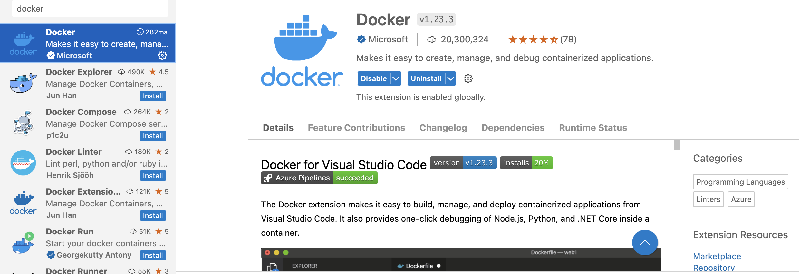

# DOCKER-CC

# Table of Contents
- [DOCKER-CC](#docker-cc)
- [Table of Contents](#table-of-contents)
- [What is Docker](#what-is-docker)
- [Commands](#commands)
  - [Some Commands](#some-commands)
  - [Docker CLI - Running and stopping containers](#docker-cli---running-and-stopping-containers)
  - [Docker CLI - Cleaning up](#docker-cli---cleaning-up)
  - [Docker CLI - Limits](#docker-cli---limits)
  - [Docker CLI - Attach to a container](#docker-cli---attach-to-a-container)
  - [Docker CLI - Building](#docker-cli---building)
  - [Docker CLI - Tagging](#docker-cli---tagging)
  - [Docker CLI - Volume](#docker-cli---volume)
  - [Run container with port mapping](#run-container-with-port-mapping)
  - [Run container with volume mapping](#run-container-with-volume-mapping)
    - [Mapping to a local folder](#mapping-to-a-local-folder)
- [Dockerfile](#dockerfile)
- [Docker extension for VS Code](#docker-extension-for-vs-code)
  - [Docker build image VS Code](#docker-build-image-vs-code)
  - [Docker run image VS Code](#docker-run-image-vs-code)
- [Persisting data](#persisting-data)
  - [Docker volumes](#docker-volumes)
  - [Testing a volume](#testing-a-volume)
  - [Remove a volume while a container is using it](#remove-a-volume-while-a-container-is-using-it)

# What is Docker
Docker is an open platform for developers and sysadmins to build, ship, and run distributed applications, whether on laptops, data center VMs, or the cloud.

# Commands
## Some Commands

`docker info` - Display system-wide information

`docker version` - Show the Docker version information

`docker login` - Register or log in to a Docker registry server

`docker help` - List Docker commands

`docker images` - List images

## Docker CLI - Running and stopping containers

**< image >** The name of the image as you find it in the container registry. **< container >** - The name or ID of the container

`docker pull <image>` - Pull an image or a repository from a registry

`docker run <image>` - Run a command in a new container

`docker run -d <image>` - Run a container in the background and print the new container ID

`docker start <container>` - Start one or more stopped containers

`docker ps` - List running containers

`docker ps -a` - List all containers

`docker stop <container>` - Stop one or more running containers

`docker restart <container>` - Restart one or more containers

`docker kill <container>` - Kill one or more running containers

`docker image inspect <image>` - Display detailed information on one or more images

## Docker CLI - Cleaning up

`docker rm <container>` - Remove one or more containers

`docker rmi <image>` - Remove one or more images

`docker rm $(docker ps -a -q)` - Remove all stopped containers

`docker system prune -a` - Remove all unused containers, networks, images (both dangling and unreferenced), and optionally, volumes

## Docker CLI - Limits

`docker run --memory=<memory>` - Memory limit **example:** `docker run --memory="256m" nginx`

`docker run --cpus=<cpus>` - CPU limit **example:** `docker run --cpus=".5" nginx`

## Docker CLI - Attach to a container

`docker container exec -it <container> bash` - Attach to a container **example:** `docker container exec -it mycontainer bash` and it will open a bash shell in the container

If you want to exit the container, you can use `exit` command.

## Docker CLI - Building

`docker build -t <image-name> .` - Build an image from a Dockerfile in the current directory **example:** `docker build -t myimage .`

`docker build -t <image-name> -f <path>` - Build an image from a Dockerfile in the specified path **example:** `docker build -t myimage -f /path/to/dockerfile`

## Docker CLI - Tagging
The tag is usually used to identify the version of the image.

`docker tag <image-name> <tag>` - Tag an existing image


## Docker CLI - Volume

`docker create volume <volume-name>` - Create a volume

`docker volume ls` - List volumes

`docker volume inspect <volume-name>` - Inspect a volume

`docker volume rm <volume-name>` - Remove a volume

`docker volume prune` - Remove all unused volumes

## Run container with port mapping

Run a container with port mapping as shown in the following image:


## Run container with volume mapping

Run a container with volume mapping as shown in the following image:


### Mapping to a local folder

Sometimes you want to map a volume to a local folder. This is useful for development purposes to test your application. **Don't use it in production**


# Dockerfile
Dockerfile is a text document that contains all the commands a user could call on the command line to assemble an image. Using docker build users can create an automated build that executes several command-line instructions in succession.

1. **Example** of Dockerfile:

    ```dockerfile
        FROM nginx:alpine
        COPY . /usr/share/nginx/html
    ```

    **Explanation**:

    - The **FROM** command tells Docker which image you base your image on. You always start with something already existing. In this case, we use the alpine version of the official nginx image from Docker Hub.
    - The **COPY** command copies everything from the current folder into the directory /usr/share/nginx/html **in the container**.

    **Build:**
    
    Build the image with the following command:

    ```bash
        docker build -t webserver-image:v1 .
    ```

    *`Note:` The dot at the end of the command is important. It tells Docker to look for the Dockerfile in the current directory.*

    **Run:**

    Run the container with the following command:

    ```bash
        docker run -d -p 8080:80 webserver-image:v1
    ```

    **Display:**

    Open a browser and go to http://localhost:8080

2. Example of Dockerfile with multiple commands:

    ```dockerfile
        FROM alpine
        RUN apk add --update nodejs nodejs-npm
        COPY . /src
        WORKDIR /src
        RUN npm install
        EXPOSE 8080
        ENTRYPOINT ["node", "./app.js"]
    ```

    

    **Explanation**:
    
    - The **RUN** command executes a command in a new layer and creates a new image. In this case, we use it to install nodejs and npm.

    - The **COPY** command copies everything from the current folder into the directory /src **in the container**.

    - The **WORKDIR** command sets the working directory for any RUN, CMD, ENTRYPOINT, COPY and ADD commands that follow it in the Dockerfile.
  
    - The **RUN** command executes a command in a new layer and creates a new image. In this case, we use it to install the dependencies of the application.
    
    - The **EXPOSE** command informs Docker that the container listens on the specified network ports at runtime. You can specify whether the port listens on TCP or UDP, and the default is TCP if the protocol is not specified.

    - The **ENTRYPOINT** command allows you to configure a container that will run as an executable.

    
# Docker extension for VS Code



If we want to add a Dockerfile to our project, we can use the Docker extension for VS Code. It will create a Dockerfile for us and we can add the commands we need.

If we open the command palette and type `Docker: Add Docker Files to Workspace`, and we follow the steps, we will get a generated Dockerfile and other docker files for a Django project, **See django_test_project/**

## Docker build image VS Code

Now we can search for `Docker: Build Image` in the command palette and we can build the image.

## Docker run image VS Code

Now we can search for `Docker: Run Image` in the command palette andthen select the image we want to run.

# Persisting data

## Docker volumes


Docker volumes are the preferred mechanism for persisting data generated by and used by Docker containers. While bind mounts are dependent on the directory structure of the host machine, volumes are completely managed by Docker. Volumes have several advantages over bind mounts:

- Volumes are easier to back up or migrate than bind mounts.

- You can manage volumes using Docker CLI commands or the Docker API.

- Volumes work on both Linux and Windows containers.

- Volumes can be more safely shared among multiple containers.

- Volume drivers allow you to store volumes on remote hosts or cloud providers, to encrypt the contents of volumes, or to add other functionality.


## Testing a volume

1. Create a volume:

    ```bash
        docker volume create myvol
    ```

2. Run a container with the volume:

    ```bash
        docker run -d --name voltest -v myvol:/app nginx:latest
    ```

3. Attach to the container:

    ```bash
        docker exec -it voltest bash
    ```

4. Install nano:

    ```bash
    # Inside the container
        apt-get update
        apt-get install nano
    ```

5. Create a file:

    ```bash
    # Inside the container
        cd /app
        nano test.txt # Write 'Hello volume!' and save
    ```

6. Exit the container:

    ```bash
    # Inside the container
        exit
    ```

7. Remove the container:

    ```bash
        docker rm -f voltest
    ```

7. Run a new container with the same volume:

    ```bash
        docker run -d --name voltest2 -v myvol:/app nginx:latest
    ```

8. Attach to the container:

    ```bash
        docker exec -it voltest2 bash
    ```

9. Check the file:

    ```bash
    # Inside the container
        cd /app
        cat test.txt
    ```

    You should see the text **'Hello volume!'** because the volume is persistent and it is stored and shared between the containers.

## Remove a volume while a container is using it

If we try to remove a volume while a container is using it, we will get an error:

```bash
    docker volume rm myvol
    Error response from daemon: remove myvol: volume is in use - [d9f9f9f9f9f9f9f9f]
```